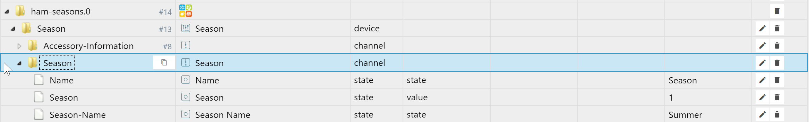

# ioBroker Seasons adapter based on homebridge-seasons


[](https://www.npmjs.com/package/iobroker.ham-seasons)


[](https://www.npmjs.com/package/iobroker.ham-seasons)


=================

This adapter is based on homebridge-seasons plugin.



Read more about it here https://www.npmjs.com/package/homebridge-seasons

## Disclaim
Of course we did not write the whole adapter only to detect the season of the year.
You can do that with just a couple of JS lines:
```
function calc() {
    const season = Math.round(((new Date().getMonth() + 1) % 12) / 3);
    const names = ['winter', 'spring', 'summer', 'autumn'];
    setState('season', names[season], true);
}
createState('season', () => {
    on('0 0 * * *', calc);
    calc();
});
```

This adapter is prove of concept for homebridge wrapper.

## Changelog

### 1.1.1 (2021-03-24)
* (Apollon77) js-controller 2.0 now needed as minimum
* (Apollon77) homebridge version and dependencies updated

### 1.1.0 (2020-08-08)
* (Apollon77) BREAKING: Nodejs 10.17.0+ needed as minimum version
* (Apollon77) homebridge version and dependencies updated

### 1.0.1 (2019.07.05)
* (Apollon77) homebridge version updated

### 1.0.0
* (Apollon77) Optimizations

### 0.2.0 (2018.06.21)
* (Apollon77) Optimizations

### 0.1.0 (2018.06.19)
* (bluefox) initial commit

## License
The MIT License (MIT)

Copyright (c) 2018-2021 bluefox <dogafox@gmail.com>

Permission is hereby granted, free of charge, to any person obtaining a copy
of this software and associated documentation files (the "Software"), to deal
in the Software without restriction, including without limitation the rights
to use, copy, modify, merge, publish, distribute, sublicense, and/or sell
copies of the Software, and to permit persons to whom the Software is
furnished to do so, subject to the following conditions:

The above copyright notice and this permission notice shall be included in
all copies or substantial portions of the Software.

THE SOFTWARE IS PROVIDED "AS IS", WITHOUT WARRANTY OF ANY KIND, EXPRESS OR
IMPLIED, INCLUDING BUT NOT LIMITED TO THE WARRANTIES OF MERCHANTABILITY,
FITNESS FOR A PARTICULAR PURPOSE AND NONINFRINGEMENT. IN NO EVENT SHALL THE
AUTHORS OR COPYRIGHT HOLDERS BE LIABLE FOR ANY CLAIM, DAMAGES OR OTHER
LIABILITY, WHETHER IN AN ACTION OF CONTRACT, TORT OR OTHERWISE, ARISING FROM,
OUT OF OR IN CONNECTION WITH THE SOFTWARE OR THE USE OR OTHER DEALINGS IN
THE SOFTWARE.
